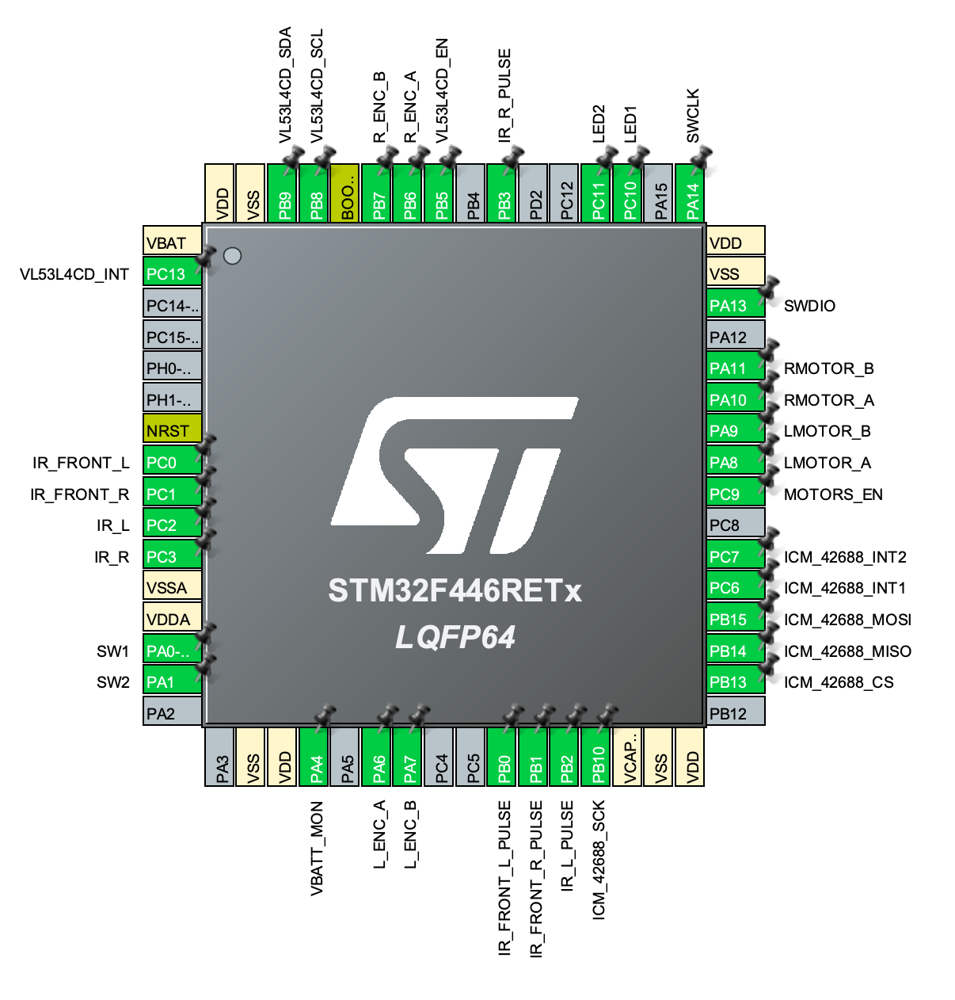

# Micromouse code

*A maze-solving micromouse implemented on STM32F446RE*

This mouse design has two DC motors driven by a TI DRV8833, and 4 IR sensors, two looking forward at an outward angle and two looking sideways, again at an angle.
Odometry is provided by a hall effect quadrature encoder on each motor.
Provision is made for a TDK ICM-42688 IMU, or a TDK ICM-45688 if and when that becomes available.
A forward-facing VL53L4CD time-of-flight ranging sensor is used for look-ahead

## Pin Descriptions

| Position | Name             | Type    | Signal           | Label            | Description                            |
|----------|------------------|---------|------------------|------------------|----------------------------------------|
| 1        | VBAT             | Power   |                  |                  |                                        |
| 2        | PC13             | I/O     | GPIO_EXTI13      | VL53L4CD_INT     | Interrupt from VL53L4CD                |
| 3        | PC14-OSC32_IN    | Output  | GPIO_Output      | VL53L4CD_EN      | Enable for VL53L4CD                    |
| 4        | PC15-OSC32_OUT   | Output  | GPIO_Output      | MOTORS_EN        | DRM8833 Enable line                    |
| 5        | PH0-OSC_IN       | Output  | GPIO_Output      | LED1             | LED 1 Output                           |
| 6        | PH1-OSC_OUT      | Output  | GPIO_Output      | LED2             | LED 2 Output                           |
| 7        | NRST             | Reset   |                  |                  |                                        |
| 8        | PC0              | I/O     | ADC1_IN10        | IR_FRONT_L       | Front Left IR Sensor                   |
| 9        | PC1              | I/O     | ADC1_IN11        | IR_FRONT_R       | Front Right IR Sensor                  |
| 10       | PC2              | I/O     | ADC1_IN12        | IR_L             | Left IR Sensor                         |
| 11       | PC3              | I/O     | ADC1_IN13        | IR_R             | Right IR Sensor                        |
| 12       | VSSA             | Power   |                  |                  |                                        |
| 13       | VDDA             | Power   |                  |                  |                                        |
| 14       | PA0-WKUP         | I/O     | SYS_WKUP0        | SW1              | Switch 1, momentary push-button input  |
| 15       | PA1              | Input   | GPIO_Input       | SW2              | Switch 2, momentary push-button input  |
| 16       | PA2              | Inpu    | GPIO_Input       | MOTOR_FAULT      | Motor fault                            |
| 17       | PA3              | I/O     |                  |                  |                                        |
| 18       | VSS              | Power   |                  |                  |                                        |
| 19       | VDD              | Power   |                  |                  |                                        |
| 20       | PA4              | I/O     | ADC1_IN4         | VBATT_MON        | Battery voltage input                  |
| 21       | PA5              | I/O     |                  |                  |                                        |
| 22       | PA6              | I/O     | GPIO_EXTI6       | ICM_42688_INT1   | Interrupt 1 from ICM-42688             |
| 23       | PA7              | I/O     | GPIO_EXTI7       | ICM_42688_INT2   | Interrupt 2 from ICM-42688             |
| 24       | PC4              | I/O     |                  |                  |                                        |
| 25       | PC5              | I/O     |                  |                  |                                        |
| 26       | PB0              | Output  | GPIO_Output      | IR_FRONT_L_PULSE | Front left IR emitter pulse enable     |
| 27       | PB1              | Output  | GPIO_Output      | IR_FRONT_R_PULSE | Front right IR emitter pulse enable    |
| 28       | PB2              | Output  | GPIO_Output      | IR_L_PULSE       | Left IR emitter pulse enable           |
| 29       | PB10             | I/O     | SPI2_SCK         | ICM_42688_SCK    | SPI Clock for ICM-42688                |
| 30       | VCAP_1           | Power   |                  |                  |                                        |
| 31       | VSS              | Power   |                  |                  |                                        |
| 32       | VDD              | Power   |                  |                  |                                        |
| 33       | PB12             | I/O     |                  |                  |                                        |
| 34       | PB13             | Output  | GPIO_Output      | ICM_42688_CS     | Chip select, active low, for ICM-42688 |
| 35       | PB14             | I/O     | SPI2_MISO        | ICM_42688_MISO   | SPI MISO for ICM-42688                 |
| 36       | PB15             | I/O     | SPI2_MOSI        | ICM_42688_MOSI   | SPI MOSI for ICM-42688                 |
| 37       | PC6              | I/O     | TIM8_CH1         | LMOTOR_A         | Left motor PWM signal 1                |
| 38       | PC7              | I/O     | TIM8_CH2         | LMOTOR_B         | Left motor PWM signal 2                |
| 39       | PC8              | I/O     | TIM8_CH3         | RMOTOR_A         | Right motor PWM signal 1               |
| 40       | PC9              | I/O     | TIM8_CH4         | RMOTOR_B         | Right motor PWM signal 2               |
| 41       | PA8              | Output  | GPIO_Output      | BT_COMMAND_MODE  | Bluetooth command mode                 |
| 42       | PA9              | I/O     | USART1_TX        |                  | Remote Serial/bootloader TX            |
| 43       | PA10             | I/O     | USART1_RX        |                  | Remote Serial/bootloader RX            |
| 44       | PA11             | I/O     |                  |                  |                                        |
| 45       | PA12             | I/O     |                  |                  |                                        |
| 46       | PA13             | I/O     | SYS_JTMS-SWDIO   | SWDIO            | Serial Wire Debug Data                 |
| 47       | VSS              | Power   |                  |                  |                                        |
| 48       | VDD              | Power   |                  |                  |                                        |
| 49       | PA14             | I/O     | SYS_JTCK-SWCLK   | SWCLK            | Serial Wire Debug Clock                |
| 50       | PA15             | I/O     |                  |                  |                                        |
| 51       | PC10             | I/O     |                  |                  |                                        |
| 52       | PC11             | I/O     |                  |                  |                                        |
| 53       | PC12             | I/O     |                  |                  |                                        |
| 54       | PD2              | I/O     |                  |                  |                                        |
| 55       | PB3              | Output  | GPIO_Output      | IR_R_PULSE       | Right IR emitter pulse enable          |
| 56       | PB4              | I/O     | TIM3_CH1         | L_ENC_A          | Left encoder channel A                 |
| 57       | PB5              | I/O     | TIM3_CH2         | L_ENC_B          | Left encoder channel B                 |
| 58       | PB6              | I/O     | TIM4_CH1         | R_ENC_A          | Right encoder channel A                |
| 59       | PB7              | I/O     | TIM4_CH2         | R_ENC_B          | Right encoder channel B                |
| 60       | BOOT0            | Boot    |                  |                  |                                        |
| 61       | PB8              | I/O     | I2C1_SCL         | VL53L4CD_SCL     | I2C bus clock for VL53L4CD             |
| 62       | PB9              | I/O     | I2C1_SDA         | VL53L4CD_SDA     | I2C bus data for VL53L4CD              |
| 63       | VSS              | Power   |                  |                  |                                        |
| 64       | VDD              | Power   |                  |                  |                                        |

