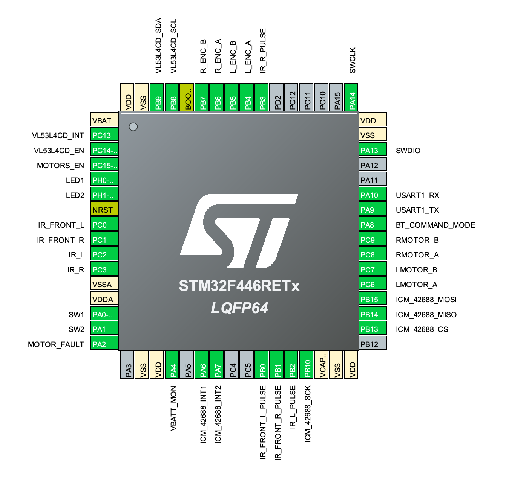

# Micromouse code

*A maze-solving micromouse implemented on STM32F446RE*

This mouse design has two DC motors driven by a TI DRV8833, and 4 IR sensors, two looking forward at an outward angle and two looking sideways, again at an angle.
Odometry is provided by a hall effect quadrature encoder on each motor.
Provision is made for a TDK ICM-42688 IMU, or a TDK ICM-45688 if and when that becomes available.
A forward-facing VL53L4CD time-of-flight ranging sensor is used for look-ahead

## Pin Descriptions

| STM32F446RE Pin number | Configuration | Name | Description |
|------------|---------------|----------|-------------|
| PA8 | PWM Output | LMotor_A | Left motor PWM signal 1 |
| PA9 | PWM Output | LMotor_B | Left motor PWM signal 2 |
| PA10 | PWM Output | RMotor_A | Right motor PWM signal 1 |
| PA11 | PWM Output | RMotor_B | Right motor PWM signal 2 |
| PC9 | GPIO Output | Motors_EN | DRM8833 Enable line |
| PB0 | GPIO Output | IR_Front_L_Pulse | Front left IR emitter pulse enable |
| PB1 | GPIO Output | IR_Front_R_Pulse | Front right IR emitter pulse enable |
| PB2 | GPIO Output | IR_L_Pulse | Left IR emitter pulse enable |
| PB3 | GPIO Output | IR_R_Pulse | Right IR emitter pulse enable |
| PC0 | ADC | IR_Front_L | Front Left IR Sensor |
| PC1 | ADC | IR_Front_R | Front Right IR Sensor |
| PC2 | ADC | IR_L | Left IR Sensor |
| PC3 | ADC | IR_R | Right IR Sensor |
| PA6 | Interrupt Input | L_ENC_A | Left encoder channel A |
| PA7 | Interrupt Input | L_ENC_B | Left encoder channel B |
| PB6 | Interrupt Input | R_ENC_A | Right encoder channel A |
| PB7 | Interrupt Input | R_ENC_B | Right encoder channel B |
| PB9 | I2C SDA | VL53L4CD_SDA | I2C bus data for VL53L4CD |
| PB8 | I2C SCL | VL53L4CD_SCL | I2C bus clock for VL53L4CD |
| PC13 | Interrupt Input | VL53L4CD_INT | Interrupt from VL53L4CD |
| PB5 | GPIO Output | VL53L4CD_EN | Enable for VL53L4CD |
| PB10 | SPI SCK | ICM-42688_SCK | SPI Clock for ICM-42688 |
| PB14 | SPI MISO | ICM-42688_MISO | SPI MISO for ICM-42688 |
| PB15 | SPI MOSI | ICM-42688_MOSI | SPI MOSI for ICM-42688 |
| PB13 | SPI CS or GPIO Output | ICM-42688_CS | Chip select, active low, for ICM-42688 |
| PC6 | GPIO Interrupt | ICM-42688_INT1 | Interrupt 1 from ICM-42688 |
| PC7 | GPIO Interrupt | ICM-42688_INT2 | Interrupt 2 from ICM-42688 |
| PA0 | GPIO Input or Interrupt | SW1 | Switch 1, momentary push-button input |
| PA1 | GPIO Input or Interrupt | SW2 | Switch 2, momentary push-button input |
| PC10 | GPIO Output | LED1 | LED 1 Output |
| PC11 | GPIO Output | LED2 | LED 2 Output |
| PA4 | ADC | VBATT | Battery voltage input |
| PA13 | SWDIO | SWDIO | Serial Wire Debug Data |
| PA14 | SWDCLK | SWDCLK | Serial Wire Debug Clock |

